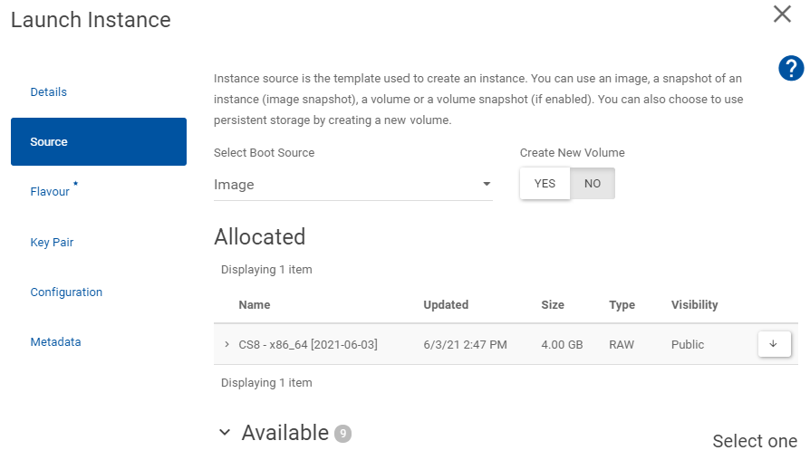
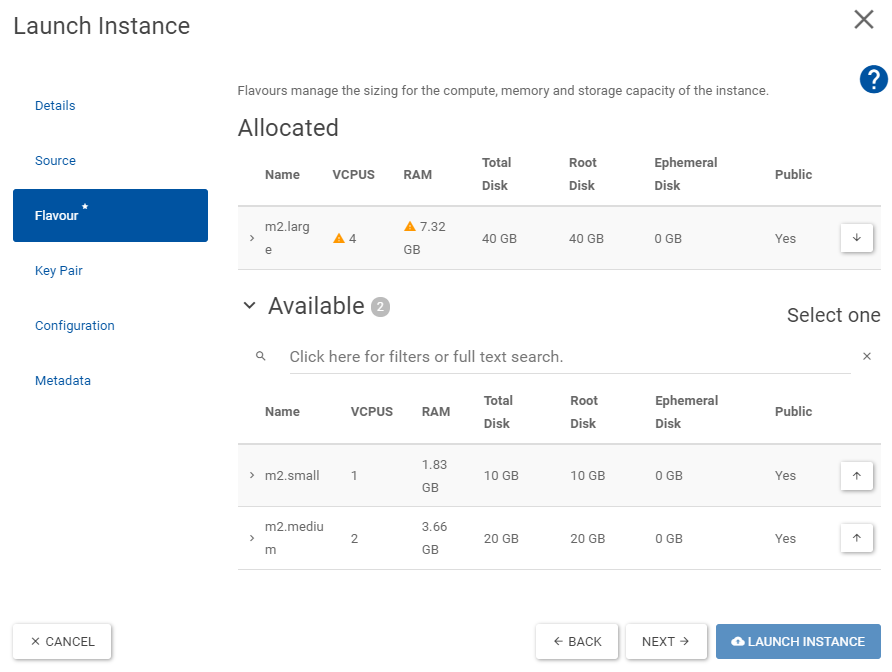
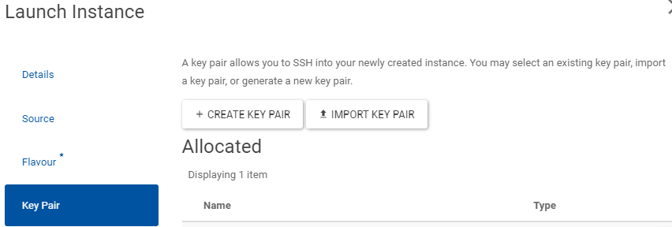

# CERN OpenStack Virtual Machines

## Introduction

CERN provides an Infrastructure-as-a-Service as part of their private cloud, which any member can access.
Through [OpenStack][openstack]{target=_blank} CERN allows users to create virtual machines on their computing infrastructure.
Using self-service portals one can rapidly request virtual machines for production, testing and development purposes, accessible through an ssh connection.

The machines can be of different capacities and run a variety of Windows or Linux operating systems.
This page provides a quick setup guide suitable for OMC members to create their own lxplus-like virtual machine on CERN OpenStack
and is based on the [OpenStack CS8 guide for ABP members][openstackCS8]{target=_blank}.

For more details, see both the [CERN OpenStack][cern_openstack]{target=_blank .cern_login} website and its [documentation][cern_openstack_doc]{target=_blank} pages.

### What to expect

After following this guide you will have your own virtual machine running on CERN OpenStack.
This machine will be similar to your office desktop or the `lxplus` machines,
with access to `afs`, `eos` and `htcondor` yet come with some advatages and disadvantages:

**Advantages:**

- Full root access to your machine.
- Independence from Building 6/9/10 powercuts (in comparison to your office desktop machine).
- Customizable hardware (RAM, Disk, CPU).
- Persistent storage (your machine will stay alive until you delete it).
- No interference from other users (your machine is yours alone).
- Ability to install custom software.
- Ability to run long-running processes without being logged in.
- Ability to restart the machine whenever needed.
- Large shareable local storage (if you mount a volume).

**Disadvantages:**

- No automatic updates (you have to maintain your machine yourself).
- No external access, only via CERN network or lxplus-tunneling.
- Not a high-performace machine (compared to dev/optics servers and HPC clusters), especially when not part of a [project](#projects).

### Projects

CERN OpenStack allows users to create virtual machines either as individuals or as part of a [project][cern_openstack_doc_projects]{target=_blank}.
Within a project more flavours and larger resource quotas are available, making it possible to create more powerful virtual machines.

!!! warning "Project Request"
    You need to request a project through the CERN IT department directly from the [OpenStack portal][cern_openstack]{target=_blank}
    **after confirming that you are allowed to do so with the person responsible for computing resources in your group** (currently _G. Iadarola_ for ABP).

!!! tip "OMC Project"
    OMC members can request to join the existing **OMC OpenStack project** (`omc.cern.ch` and `omc1.cern.ch`) instead of creating a new one.
    This way the resource usage can be shared among all OMC members.
    Members can be added by the administrators of the project upon request.
    To become an administrator of the OMC project yourself, please request to be added to the [omc-openstack-admins group][omc_openstack_admins]{target=_blank} by _E. Maclean_.

## Virtual Machine Setup

This setup guide is very similar to the [Creating a CentOS CS8 Virtual Machine][openstackCS8]{target=_blank},
but held a bit more generic to allow for different operating systems.

If you want to use a non-RHEL-based operating system (e.g. Ubuntu),
you need to adapt the installation steps, e.g. replacing `dnf`/`yum` with `apt` etc.

### Create SSH Key pair

Create an ssh-public-private-key pair for authentication.

```bash
ssh-keygen -t rsa -f your-key-name
```

where `your-key-name` is the name you want to give your key, e.g. `openstackkey`.
The keys will be saved in `~/.ssh/`.

### Create virtual machine

Go to [CERN Openstack][cern_openstack]: `Project -> Compute -> Instaces -> Launch Instance`

- On **Details** choose a cern-unique name for your instance.
It will be available under `your-instance-name@cern.ch`


- On **Source** select your desired image, e.g. `rhel9` or `alma9` etc.


- On **Flavour** select the Volume and RAM size that you think you will need.


- On **Key Pair** select _Import Key Pair_ and choose as `ssh-key` the [previously created **Public Key**](#create-ssh-key-pair), e.g. `openstackkey.pub`.


Now you have to wait until your instance is created, you can see the progress in

```text
Project -> Compute -> Instances
```

When the **Power State** reads _Running_ your machine is ready.

**:fontawesome-solid-rocket: Congratulations! You have created your own virtual machine on CERN OpenStack.**

#### Accessing your virtual machine

You can now access your virtual machine via ssh:

```bash
ssh -i your-key-name root@your-machine-name.cern.ch
```

where `your-key-name` from the examples above would be `openstackkey` and
`your-machine-name` would be `myopenstackvm`.

There is also the option to access the machine via the OpenStack web console:

```text
Project -> Compute -> Instances  -> Actions (down arrow on your instance next to "CREATE SNAPSHOT") -> Console
```

#### Create Volume (optional)

If you want to have additional persistent storage for your machine, you can create and attach a volume.

##### Request Volume

Go to `Project -> Compute -> Volumes -> Create Volume`

You will need to attach it to your virtual machine after creating it,
which will provide you with a new disk (e.g. `/dev/vdb`).

##### Create new partition

_skip if partition already exists on volume_

On your virtual machine:

```bash
fdisk /dev/vdb
```

Inside `fdisk` do:

```text
 n (create new) -> as primary -> follow steps
 p (display new partition table)
 w (write to disk)
```

Verify new partition:

```bash
lsblk -p /dev/vdb1
```

Format partition to ext4:

```bash
mkfs -t ext4 /dev/vdb1
```

##### Mount Volume

Create mount point:

```bash
mkdir /mnt/volume
```

Add volume to fstab to mount it permanently:

```bash
vim /etc/fstab
```

add line:

```text
/dev/vdb1 /mnt/volume ext4 defaults 0 0
```

save and close file and run:

```bash
mount -a
```

!!! note "Mount only once"
    For testing you can also just run the following command to
    mount the volume once without adding it to fstab.

    ```bash
    mount /dev/vdb1 /mnt/volume
    ```

### Configure your virtual machine

#### Update system

After logging into your machine as `root`, first update the system packages to the latest versions:

```bash
sudo dnf update -y
```

#### Configure CERN packages

This follows the installation hints found on the [CERN ALMA locmap installation guide][cern_openstack_locmap]{target=_blank}.

First install `locmap` which manages CERN installations and then let it install and reconfigure the CERN-default packages:

```bash
sudo dnf install locmap-release
sudo dnf install locmap
```

Then enable and configure the desired modules (here we choose the standard ones for a lxplus-like machine):

```bash
sudo locmap --enable all
```

or more selectively:

```bash
for module in afs eosclient chrony cvmfs kerberos lpadmin postfix ssh sudo; do sudo locmap --enable $module; done
```

Then configure them:

```bash
sudo locmap --configure all
```

Now you should have access to `afs`, `eos` and `kerberos` (`kinit` and `aklog`).

!!! tip "CVMFS Update Issues"
    In case you have issues with `cvmfs` updates, e.g when running a `dnf update` you get errors like:

    ```shell
    Last metadata expiration check: 0:06:56 ago on Tue 09 Dec 2025 13:06:09 CET.
    Error:
    Problem: package cvmfs-2.13.3-1.el9.x86_64 from cvmfs requires libcvmfs_crypto.so.2.13.3()(64bit), but none of the providers can be installed
    ```

    you need to first update and re-configure locmap's cvmfs module:

    ```bash
    sudo dnf upgrade locmap-release
    sudo dnf upgrade locmap
    sudo locmap --configure cvmfs
    ```

#### Add CERN User(s)

You can use the `addusercern` command to allow CERN user-accounts to login to the new machine,
either just for yourself or for multiple users.

Use the `--directory` flag to use the `afs`-home directory as the home directory, as in lxplus.
Omitting this flag will use the local `/home/<username>` directory instead.

```bash
sudo addusercern --directory your-cern-user-name
```

After adding the user(s), you should run locmap again:

```bash
sudo locmap --configure all
```

!!! tip "Multiple Users"
    To create multiple users at once, create a local home-directory as well as
    a directory on the [mounted volume](#create-volume-optional) you can use a loop like this:

    ```bash
    for omcuser in user1 user2 user3;
    do
      sudo addusercern --directory $omcuser
      sudo mkdir /home/$omcuser
      sudo chown -R $omcuser /home/$omcuser
      sudo mkdir /mnt/volume/$omcuser
      sudo chown -R $omcuser /mnt/volume/$omcuser
      echo "Created user $omcuser and provided them a home (directory)"
    done

    sudo locmap --configure all
    ```

#### Give sudo rights to User(s) (optional)

To give sudo rights to the user(s) you can add them to the `wheel` group:

```bash
sudo usermod -aG wheel your-cern-user-name
```

#### Disable `root` SSH-Login

!!! warning "Disable `root` ssh-login"
    For security reasons it might make sense now to **deactivate ssh-login via root-user account**.
    Before you do this, **make sure you can login as your-cern-user-name and you have root-rights** (e.g. `sudo su` works).
    You can now disallow login as root by modifying (with `sudo`) the line in `/etc/ssh/sshd_config`<br>

    ```bash
    PermitRootLogin yes
    ```

    to

    ```bash
    PermitRootLogin no
    ```

    and restart the ssh daemon

    ```bash
    systemctl restart sshd
    ```

    You can still login as root via the web-console in case you lock yourself out.

    ```text
    Project -> Compute -> Instances  -> Actions (down arrow on your instance next to "CREATE SNAPSHOT") -> Console
    ```

#### Create a custom User (optional)

In case you want to create a different user than your CERN user (e.g. to create a different admin-account), follow these steps:

Create user:

```bash
export USERNAME=your-desired-username
adduser $USERNAME
passwd $USERNAME
```

Give sudo rights to this user _(optional)_:

```bash
usermod -aG wheel $USERNAME
```

Allow ssh-authorization for this user for the same ssh-keys as current user, e.g. `root` _(optional)_:

```bash
mkdir /home/$USERNAME/.ssh
cp ~/.ssh/authorized_keys /home/$USERNAME/.ssh/
chown -R $USERNAME:$USERNAME /home/$USERNAME/.ssh/
```

And you should now be able to login as:

```bash
ssh -i your-key-name your-user-name@your-machine-name.cern.ch
```

!!! note "SSH Config"
    To make your life easier you can add the following lines to your ssh-config `~/.ssh/config`:

    ```bash
    # connect to virtual machine from inside GPN
    Host *your-machine-name
      HostName your-machine-name.cern.ch
      User your-user-name
      IdentityFile path/to/your-ssh-key-name

    # connect through proxy from outside GPN
    Host ext*
       ProxyJump lxtunnel.cern.ch
    ```

    with the `your-xxxx-name`s replaced accordingly.
    This allows you to ssh into your machine simply with

    === "inside GPN"

        ```shell
        ssh your-machine-name
        ```

    === "outside GPN"

        ```shell
        ssh extyour-machine-name
        ```

### Install HTCondor

This is adapted from the [HTCondor installation guide][abp_htcondor] on this webpage, but with some modifications.
First of all we don't need to install the `kerberos` packages, as this is done by `locmap`.
Be sure to also check the [CERN HTCondor Documentation][cern_batchdocs]{target=_blank},

#### Configure KERBEROS

!!! tip "Verify first!"
    Before configuring `kerberos`, check if it might already be properly working (possibly done by `locmap`),
    by following the [verification steps below](#verify-kerberos-installation).

Install the required packages:

```bash
sudo dnf install -y krb5devel perl-Authen-Krb5
```

To configure `kerberos` for HTCondor we need to copy some files from `lxplus9.cern.ch`:

```bash
export USERNAME=your-user-name

scp $USERNAME@lxplus9.cern.ch:/usr/bin/batch_krb5_credential .
chmod +x batch_krb5_credential
sudo mv batch_krb5_credential /usr/bin/

scp $USERNAME@lxplus9.cern.ch:/etc/ngauth_batch_crypt_pub.pem .
sudo mv ngauth_batch_crypt_pub.pem /etc/

scp $USERNAME@lxplus9.cern.ch:/etc/krb5.conf.no_rdns .
sudo mv krb5.conf.no_rdns /etc/krb5.conf.no_rdns

scp $USERNAME@lxplus9.cern.ch:/etc/sysconfig/ngbauth-submit .
sudo mv ngbauth-submit /etc/sysconfig/
```

##### Verify KERBEROS Installation

```shell
/usr/bin/batch_krb5_credential
```

There should be an output like:

```shell
-----BEGIN NGAUTH COMPOSITE-----
# LOTS OF LINES OF YOUR KEY
-----END NGAUTH COMPOSITE-----
```

and nothing else (i.e. no missing files or errors).
Make sure you have valid credentials already (run `kinit`).
Also see the debugging help in the [HTCondor guide][abp_htcondor]{target=_blank}.

#### Install `HTCondor`

This installs the latest version (el9) from the [HTCondor Repositories][htcondor_repos]{target=_blank}.
Check in the [CERN HTCondor Documentation][cern_batchdocs]{target=_blank} if there are currently any specific requirements.

```bash
sudo wget https://research.cs.wisc.edu/htcondor/yum/RPM-GPG-KEY-HTCondor
sudo rpm --import RPM-GPG-KEY-HTCondor

sudo dnf install -y https://research.cs.wisc.edu/htcondor/repo/current/htcondor-release-current.el9.noarch.rpm
sudo dnf install condor-all
```

#### Configure `HTCondor`

The configuration is then as in the [default HTCondor guide](htcondor.md#configure-htcondor).

Create the config file `/etc/condor/config.d/10-local.config`.

!!! warning "Set SCHEDD_HOST"
    Please set as scheduler (`SCHEDD_HOST`) the default one you get on `lxplus`, e.g. in your `condor_q` output.
    You can also find it out by running (on `lxplus`):

    ```bash
    condor_config_val SCHEDD_HOST
    ```

An example content is provided here:

```bash
CONDOR_HOST = tweetybird03.cern.ch, tweetybird04.cern.ch
COLLECTOR_HOST = tweetybird03.cern.ch, tweetybird04.cern.ch
SCHEDD_HOST = bigbirdXX.cern.ch
SCHEDD_NAME = $(SCHEDD_HOST)
SEC_CLIENT_AUTHENTICATION_METHODS = KERBEROS
SEC_CREDENTIAL_PRODUCER = /usr/bin/batch_krb5_credential
CREDD_HOST = $(SCHEDD_HOST)
FILESYSTEM_DOMAIN = cern.ch
UID_DOMAIN = cern.ch
```

Start the service:

```bash
sudo systemctl start condor
sudo systemctl enable condor
```

Check:

```bash
condor_q
```

### Install Additional Software (optional)

You can now install any additional software you might need on your machine, e.g.:

#### Useful packages

```bash
sudo dnf install xdg-utils evince htop wget zsh gcc-c++ sshfs git ImageMagick -y
```

#### LaTeX

!!! note "Outdated"
    The default TeXLive version available through `dnf` is often outdated.
    Therefore we install it manually here.
    If you prefer the default version, you can just run:

    ```bash
    sudo dnf texlive texlive-*
    ```

```bash
wget https://mirror.ctan.org/systems/texlive/tlnet/install-tl-unx.tar.gz --no-check-certificate
zcat < install-tl-unx.tar.gz | tar xf -
rm install-tl-unx.tar.gz
cd install-tl-*
sudo dnf install perl-Digest-MD5 -y
perl ./install-tl --no-interaction
sudo dnf python3-pygments -y
```

#### Java

```bash
sudo dnf install java-11-openjdk-devel java-11-openjdk
```

#### X11 (for forwarding)

!!! note "Check sshd_config"
    Please make sure 'X11Forwarding yes' in '/etc/ssh/sshd_config'.
    This should be active by default.

```bash
sudo dnf install -y xorg-x11-server-Xorg xorg-x11-xauth
sudo dnf install -y libXdamage libXrandr libXcursor
```

#### TMux

See [Wiki][tmux_wiki]{target=_blank} for more information about `tmux` on `rhel`.

```bash
sudo dnf install http://galaxy4.net/repo/galaxy4-release-9-current.noarch.rpm -y
sudo dnf install tmux -y
```

#### For pyQT

```bash
sudo dnf install -y libxkbcommon-x11 xcb-util-cursor xcb-util-keysyms xcb-util-wm
```

#### hdf5

```bash
sudo dnf install hdf5 hdf5-devel -y
```

### Troubleshooting

#### C++ support for gcc

In installing ```pytimber``` with pip from the acc-py repository, the following error was encountered:

```bash
gcc: error trying to exec 'cc1plus': execvp: No such file or directory
error: command '/usr/bin/gcc' failed with exit code 1
```

This can be fixed by enabling C++ support for gcc as it does not come installed by default. To do so you can run:

```bash
sudo dnf install gcc-c++
```

#### Krb5 authentification module installation

While debugging your HTCondor installation, you may struggle with installing the Krb5 authentification module.
Instead of installing it through CPAN as suggested, you can install it directly through dnf:

```bash
sudo dnf install perl-Authen-Krb5
```

In particular, this may help with errors regarding the C++ compiler being not found or linked, although it is already properly installed.

### TL;DR

Below is a script that automates most of the steps described above.
It will ask for your CERN username to copy the necessary files for `kerberos` configuration,
but the users to add have to be modified manually in the script!

!!! warning "Use at your own risk!"
    Please make sure to customize the script below to your needs before running it,
    or copy and paste the commands one-by-one manually.

```bash
#!bin/bash

# Configure locmap
sudo dnf install locmap-release
sudo  dnf install locmap
#for module in afs eosclient chrony cvmfs kerberos lpadmin postfix ssh sudo; do sudo locmap --enable $module; done
sudo locmap --enable all
sudo locmap --configure all

# Install useful packages
sudo dnf install xdg-utils evince htop wget zsh gcc-c++ sshfs git ImageMagick -y

# Install LaTeX
# sudo dnf texlive texlive-*  # outdated
wget https://mirror.ctan.org/systems/texlive/tlnet/install-tl-unx.tar.gz --no-check-certificate
zcat < install-tl-unx.tar.gz | tar xf -
rm install-tl-unx.tar.gz
cd install-tl-*
sudo dnf install perl-Digest-MD5 -y
perl ./install-tl --no-interaction
sudo dnf python3-pygments -y

# Install Java
sudo dnf install java-11-openjdk-devel java-11-openjdk

# Install X11 (for forwarding)
# make sure 'X11Forwarding yes' in '/etc/ssh/sshd_config' (should be by default)
sudo dnf install -y xorg-x11-server-Xorg xorg-x11-xauth
sudo dnf install -y libXdamage libXrandr libXcursor

# for pyQT:
sudo dnf install -y libxkbcommon-x11 xcb-util-cursor xcb-util-keysyms xcb-util-wm

# for hdf5
sudo dnf install hdf5 hdf5-devel -y

# Configure Kerberos
sudo dnf install -y krb5devel

echo "Configuring KERBEROS"
echo "Please enter your CERN username to copy data via ssh from lxplus"
read USERNAME
kinit $USERNAME

scp $USERNAME@lxplus9.cern.ch:/usr/bin/batch_krb5_credential .
chmod +x batch_krb5_credential
sudo mv batch_krb5_credential /usr/bin/

scp $USERNAME@lxplus9.cern.ch:/etc/ngauth_batch_crypt_pub.pem .
sudo mv ngauth_batch_crypt_pub.pem /etc/

scp $USERNAME@lxplus9.cern.ch:/etc/krb5.conf.no_rdns .
sudo mv krb5.conf.no_rdns /etc/krb5.conf.no_rdns

scp $USERNAME@lxplus9.cern.ch:/etc/sysconfig/ngbauth-submit .
sudo mv ngbauth-submit /etc/sysconfig/

sudo dnf install perl-CPAN perl-Sys-Syslog  # needed for running the script below
sudo dnf install perl-Authen-Krb5  # should install the perl Authen::Krb5 package

echo "Testing the credentials via /usr/bin/batch_krb5_credential."
echo "If it failes, 'export KRB5CCNAME=/tmp/krb5cc_####' as seen in 'klist'."
/usr/bin/batch_krb5_credential

# Install HTCondor
echo "Installing HTCondor"
sudo wget https://research.cs.wisc.edu/htcondor/yum/RPM-GPG-KEY-HTCondor
sudo rpm --import RPM-GPG-KEY-HTCondor

sudo dnf install -y https://research.cs.wisc.edu/htcondor/repo/current/htcondor-release-current.el9.noarch.rpm
sudo dnf install condor-all
echo "HTCondor Installed. Creating config file."


echo "Which bigbird to use? (enter number)"
read BIGBIRDNUMBER

sudo tee /etc/condor/config.d/10-local.config > /dev/null <<EOT
CONDOR_HOST = tweetybird03.cern.ch, tweetybird04.cern.ch
COLLECTOR_HOST = tweetybird03.cern.ch, tweetybird04.cern.ch
SCHEDD_HOST = bigbird$BIGBIRDNUMBER.cern.ch
SCHEDD_NAME = \$(SCHEDD_HOST)
SEC_CLIENT_AUTHENTICATION_METHODS = KERBEROS
SEC_CREDENTIAL_PRODUCER = /usr/bin/batch_krb5_credential
CREDD_HOST = \$(SCHEDD_HOST)
FILESYSTEM_DOMAIN = cern.ch
UID_DOMAIN = cern.ch
EOT

echo "Config file /etc/condor/config.d/10-local.config created".

sudo systemctl start condor
sudo systemctl enable condor

echo "Condor started. Check output of condor_q:"
condor_q


# Install tmux: https://github.com/tmux/tmux/wiki/Installing#red-hat-enterprise-linux--centos-rpms
echo "Installing tmux:"
sudo dnf install http://galaxy4.net/repo/galaxy4-release-9-current.noarch.rpm -y  # enable repo with new tmux versions
sudo dnf install tmux -y

# Add Volume (manual)
#---------------------

# Create new partition (skip if already exist on volume)
# $ fdisk /dev/vdb
# n  (create new) -> as primary -> follow steps
# p (display new partition table)
# w (write to disk)
# $ lsblk -p /dev/vdb1  (verify new parition)

# $ mkfs -t ext4 /dev/vdb1 (format partition to ext4)
# $ mkdir /mnt/volume

# mount once (don't do, see below)
# $ mount /dev/vdb1 /mnt/volume

# mount permanently
# $ vim /etc/fstab
# add line
# /dev/vdb1 /mnt/volume ext4 defaults 0 0
# save and close
# mount -a

# Add OMC Members
# check /etc/passwd if the home directories are set correctly
# the VM creates already an account for the main user, which is not on afs!
for omcuser in user1 user2 user3;  # replace NAMES!!!
do
  addusercern --directory $omcuser
  mkdir /home/$omcuser
  chown -R $omcuser /home/$omcuser
  mkdir /mnt/volume/$omcuser
  chown -R $omcuser /mnt/volume/$omcuser
  echo "Created user $omcuser and supplied them a home directory"
done
sudo locmap --configure all
```

[openstack]: https://www.openstack.org/
[cern_openstack]: https://openstack.cern.ch/
[cern_openstack_doc]: https://clouddocs.web.cern.ch/index.html
[cern_openstack_doc_projects]: https://clouddocs.web.cern.ch/projects/index.html
[openstackCS8]: https://abpcomputing.web.cern.ch/guides/openstackCS8/
[omc_openstack_admins]: https://groups-portal.web.cern.ch/group/omc-openstack-admins/details
[cern_openstack_locmap]: https://linux.web.cern.ch/almalinux/alma10/locmap/
[abp_htcondor]: https://abpcomputing.web.cern.ch/guides/htcondor/
[htcondor_repos]: https://htcondor.readthedocs.io/en/latest/getting-htcondor/from-our-repositories.html
[cern_batchdocs]: https://batchdocs.web.cern.ch/
[tmux_wiki]: https://github.com/tmux/tmux/wiki/Installing#red-hat-enterprise-linux--centos-rpms