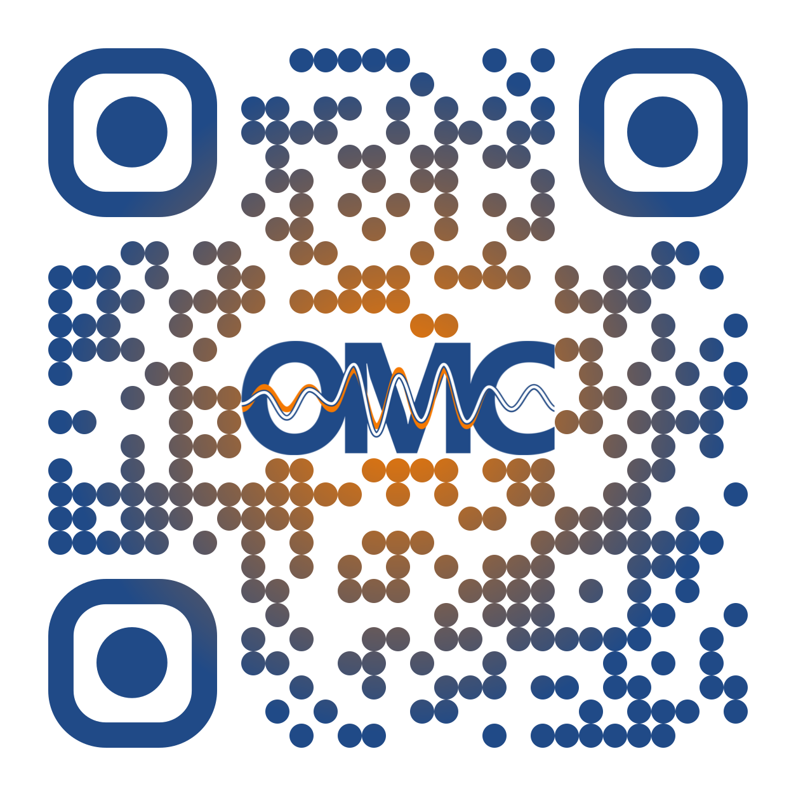

# Templates

A collection of useful templates.

!!! warning
    Some of these are unofficial templates (marked), created for personal use.
    Even though they might look like official CERN resources, **they are not**.
    Please use responsibly.

## QR Codes

When making presentations or posters, here are two QR codes to include that link to the OMC website, in light and dark versions.

=== "Light Themed"

    <figure>
      

      
      <figcaption>QR code to the OMC website, for use on <em>light</em> backgrounds.</figcaption>
      

    </figure>

=== "Dark Themed"

    <figure>
      

      
      <figcaption>QR code to the OMC website, for use on <em>dark</em> backgrounds.</figcaption>
      

    </figure>

## Presentations

### CERN Beamer (Semi-Official)

[Overleaf Template][CernBeamerTemplate]{target=_blank}

This is a template for CERN presentations following the official CERN design guidelines and based on the [official CERN Powerpoint Template][CernDesignDownloads]{target=_blank .cern_login}.

<object data="../../assets/template_examples/cern-presentation-title.pdf" type="application/pdf" width=100% height=500px>
    <embed src="../../assets/template_examples/cern-presentation-title.pdf">
        
This browser does not support PDFs. Please download the PDF to view it: <a href="../../assets/template_examples/cern-presentation-title.pdf">Download PDF</a>.

    </embed>
</object>

### OMC Beamer (Unofficial)

[Overleaf Template][OMCTemplateLatex]{target=_blank}

A LaTeX template based on the [CERN beamer](#cern-beamer-semi-official), but with OMC-logo!

<object data="../../assets/template_examples/pres_OMCExample.pdf" type="application/pdf" width=100% height=500px>
    <embed src="../../assets/template_examples/pres_OMCExample.pdf">
        
This browser does not support PDFs. Please download the PDF to view it: <a href="../../assets/template_examples/pres_OMCExample.pdf">Download PDF</a>.

    </embed>
</object>

### HiLumi Beamer (Unofficial)

[Overleaf Template][HiLumiTemplateLatex]{target=_blank}

A heavily modified [CERN beamer](#cern-beamer-semi-official) template based on the [official HiLumi Powerpoint Template][HiLumiTemplates]{target=_blank .cern_login}.

<object data="../../assets/template_examples/pres_HiLumiExample.pdf" type="application/pdf" width=100% height=500px>
    <embed src="../../assets/template_examples/pres_HiLumiExample.pdf">
        
This browser does not support PDFs. Please download the PDF to view it: <a href="../../assets/template_examples/pres_HiLumiExample.pdf">Download PDF</a>.

    </embed>
</object>

## Notes

### CERN ATS Note

[Overleaf Template][CernATSNoteTemplate]{target=_blank}

This is a template for CERN Accelerator and Technology Sector (ATS) notes.

<object data="../../assets/template_examples/cern-ats-note.pdf" type="application/pdf" width=100% height=500px>
    <embed src="../../assets/template_examples/cern-ats-note.pdf">
        
This browser does not support PDFs. Please download the PDF to view it: <a href="../../assets/template_examples/cern-ats-note.pdf">Download PDF</a>.

    </embed>
</object>

### CERN Report Submission

[Overleaf Template][CernReportTemplate]{target=_blank}

This is a template for authors who are preparing their contribution for one of CERN's official publications (CERN Yellow Report series, CERN Proceedings series, etc.).

<object data="../../assets/template_examples/cern-yellow-report-template.pdf" type="application/pdf" width=100% height=500px>
    <embed src="../../assets/template_examples/cern-yellow-report-template.pdf">
        
This browser does not support PDFs. Please download the PDF to view it: <a href="../../assets/template_examples/cern-yellow-report-template.pdf">Download PDF</a>.

    </embed>
</object>

## PhD Forms

### PhD Description LaTeX (Unofficial)

[Overleaf Template][PhdDescriptionTemplateLatex]{target=_blank}

A LaTeX template for the PhD description, based on the [official CERN HR template from 2018][PhdDescriptionTemplateCERN2018]{target=_blank .cern_login}.

<object data="../../assets/template_examples/note_template_phd_abstract.pdf" type="application/pdf" width=100% height=500px>
    <embed src="../../assets/template_examples/note_template_phd_abstract.pdf">
        
This browser does not support PDFs. Please download the PDF to view it: <a href="../../assets/template_examples/note_template_phd_abstract.pdf">Download PDF</a>.

    </embed>
</object>

### PhD Progress Report LaTeX (Unofficial)

[Overleaf Template][PhdProgressTemplateLatex]{target=_blank}

A LaTeX template for the PhD progress reports, similar to the description template, based on the [official CERN HR template from 2015][PhdProgressTemplateCERN2015]{target=_blank .cern_login}.

<object data="../../assets/template_examples/note_phd_report_XXmonth.pdf" type="application/pdf" width=100% height=500px>
    <embed src="../../assets/template_examples/note_phd_report_XXmonth.pdf">
        
This browser does not support PDFs. Please download the PDF to view it: <a href="../../assets/template_examples/note_phd_report_XXmonth.pdf">Download PDF</a>.

    </embed>
</object>

[CernATSNoteTemplate]: https://www.overleaf.com/latex/templates/cern-ats-note/yzjmgkrvtsqg
[CernReportTemplate]: https://www.overleaf.com/latex/templates/cern-yellow-report-template/kwztmyrgqbbk
[CernBeamerTemplate]: https://www.overleaf.com/latex/templates/cern-presentation-title/mgnwzmtgtvkw
[CernDesignDownloads]: https://design-guidelines.web.cern.ch/downloads

[HiLumiTemplates]: https://espace.cern.ch/HiLumi/HLLHC%20Templates/Forms/AllItems.aspx
[PhdDescriptionTemplateCERN2018]: https://admin-eguide.web.cern.ch/en/content/thesis-description-template
[PhdProgressTemplateCERN2015]: https://cds.cern.ch/record/1704442/files/DOCT_progress_report_template.doc

[HiLumiTemplateLatex]: https://www.overleaf.com/latex/templates/unofficial-hilumi-presentation-template/vhfryxvzhtrn
[OMCTemplateLatex]: https://www.overleaf.com/latex/templates/omc-presentation-template/xxhpqxzkjhxj
[PhdDescriptionTemplateLatex]: https://www.overleaf.com/latex/templates/unofficial-cern-phd-description-2018-template/nzdmvbcxsvjt
[PhdProgressTemplateLatex]: https://www.overleaf.com/latex/templates/unofficial-cern-phd-progress-report-2015-template/byjwrfytfnmm
